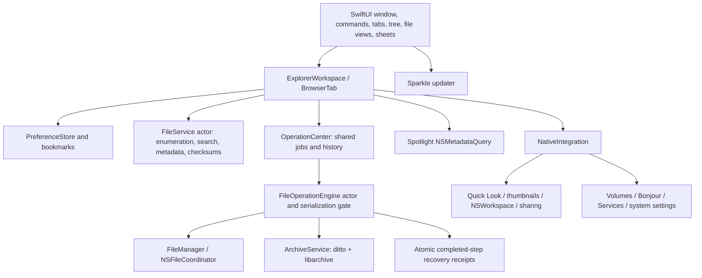

# Architecture

## Layering

`ExplorerCore` contains value models, path/name logic, search expressions, filesystem services, transfers, recovery, and archives. It has no SwiftUI dependency. It targets macOS because resource tags, ubiquitous-item semantics, coordinated access, Trash, and bookmark APIs are operating-system services.

`MacExplorer` owns application UI and system entry points. All app-created windows, layout, rows, buttons, menus, forms, dialogs, and settings are SwiftUI. Small AppKit bridges obtain the owning NSWindow and embed Apple's Quick Look view. AppKit is also used as an operating-system API surface for the pasteboard, application launch, file panels, system icons, and event routing; it is not a second custom UI implementation. The web design is not embedded in the native app.

## Ownership and concurrency

Each `ExplorerWorkspace` owns a nonempty tab collection, active tab identity, modal state, and window reference. Each `BrowserTab` owns navigation history, file snapshots, selection, view options, search generation, directory watcher, and Spotlight query. `PreferenceStore` is process-wide. `OperationCenter` is process-wide so file work remains visible across windows and quit is guarded while operations are active.

Main-actor models publish immutable file snapshots from filesystem actors. Directory enumeration, checksums, archive work, and transfer calls do not execute as SwiftUI body work. Search uses cancellation plus a generation counter so a late result from an old folder cannot overwrite a newer navigation request. Directory watcher notifications are debounced. Spotlight query lifetimes and observers are explicit.

Swift actors are reentrant across `await`. FileOperationEngine therefore adds an explicit FIFO gate: waiting for a user collision decision must not allow another window's mutation to run concurrently through the same engine. Other applications remain independent actors; filesystem errors/races must still be handled. The engine is not a filesystem-wide lock.

## Transfer protocol

1. Collapse duplicate/nested source selections without following selected symbolic-link roots.
2. Reject protected roots and descendant destinations.
3. Resolve collisions with Keep Both, Replace, Skip, Cancel, and apply-to-all.
4. Stage a copy, move, or symbolic link in a unique hidden sibling.
5. Before installation, check cancellation and destination changes.
6. For Replace, retain the previous destination under a unique hidden backup name.
7. Rename the completed stage into place.
8. Record an inverse operation with file identity, size, and modification-time fingerprint. Persist each completed source receipt atomically.
9. On failure, attempt rollback without deleting either an original or replacement backup. Return per-item errors and any completed receipts.

This makes individual same-volume renames useful installation boundaries, not a claim of atomic whole-directory transfer across every network or cloud filesystem. No byte-level transaction journal or durable pre-intent WAL is implemented. Power loss between filesystem mutation and receipt persistence can leave hidden stages/backups for manual recovery. Replacement backups are intentionally not auto-purged.

Undo validates the recorded fingerprint and refuses occupied destinations. Removal of a copied output uses Trash, not irreversible deletion. Fingerprints are conservative guards, not recursive content hashes or a substitute for backups. Deep child edits may not change a directory's own metadata, which is another reason removal during undo remains recoverable via Trash.

## Search and view model

Search supports literal words/quoted phrases and `name:`, `ext:`, `kind:`, `tag:`, `size:`, `modified:`, `content:`. Predicates bind arguments rather than composing executable expressions from user strings. Content and whole-computer search delegate to Spotlight. Recursive enumeration skips package descendants and symlink descendants and reports result limits explicitly.

File identity in a displayed snapshot is the standardized URL, not a string basename. Tree expansion is lazy; bookmarks preserve pinned locations when possible. FileOptions stores layout, sort, direction, grouping, and folders-first behavior per location. Native table customization persists column state separately through scene storage.

## Archive safety

ZIP creation invokes `/usr/bin/ditto` with explicit arguments, not a shell command string. Standard error goes to a bounded-lifetime temporary log to avoid pipe backpressure deadlocks.

libarchive extraction uses a newly created private directory. It rejects absolute paths, traversal components, Windows-style path separators/drives, symlinks, hardlinks, device nodes, duplicate files, over 100,000 entries, and expansion over 20 GB. It publishes the completed directory only after extraction succeeds. Do not weaken those checks merely to make an unusual archive extract; trusted specialized archives can be opened with a dedicated utility.

## Update trust

Sparkle 2.9.6 is an exact package dependency. Builds embed the framework with its helpers and licenses, set an executable-relative framework rpath, and opt into archive-before-extraction verification and signed feeds. The public key is supplied at build time; without it, the updater remains disabled. Release jobs resolve/build tools before loading private credentials, sign existing build artifacts, independently verify Ed25519 against the bundled public key, and publish all assets through a draft release.
